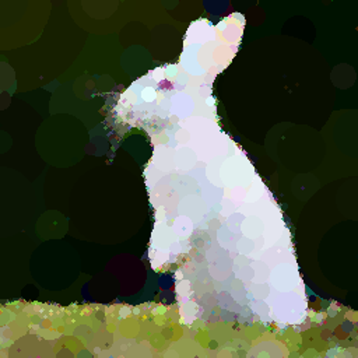

# Abstracta2.0

A Python-based tool that recreates images using simple geometric shapes (circles or triangles). This project builds upon geometric primitive image generation techniques to create abstract representations of target images.

## Features

- Support for multiple geometric primitives (circles and triangles)
- Command-line interface with customizable parameters
- Progress tracking with time estimates
- Intermediate result saving
- Configurable output resolution
- Performance optimizations using NumPy

## Installation

1. Clone the repository:
```bash
git clone https://github.com/Muneer320/Abstracta2.0
cd Abstracta2.0
```

2. Install required dependencies:
```bash
pip install numpy Pillow
```

## Usage

The program can be run from the command line with various options:

```bash
python main.py -i <input_image> [options]
```

### Required Arguments:
- `-i, --image`: Path to the input image

### Optional Arguments:
- `-s, --shape`: Shape to use ('circle' or 'triangle', default: circle)
- `-n, --number`: Number of shapes to generate (default: 1200)
- `-r, --resolution`: Output resolution (default: 512)
- `-w, --working-res`: Working resolution (default: 256)
- `-k, --keep-progress`: Save progress images (default: True)
- `--no-progress`: Disable saving progress images

### Example:
```bash
python main.py -i input/photo.jpg -s circle -n 1000 -r 1024
```

## Algorithm Overview

1. **Image Initialization**
   - Load and resize target image to working resolution
   - Initialize canvas with average color of target image

2. **Shape Generation**
   - Supports two primitive types:
     - Circles: Defined by center point (x, y), radius, and RGB color
     - Triangles: Defined by three vertices and RGB color

3. **Optimization Process**
   - Uses hill climbing algorithm to find optimal shapes
   - Performs multiple attempts with random starting positions
   - Mutates shapes to minimize root mean square error
   - Implements efficient numpy-based calculations

4. **Progress Tracking**
   - Real-time progress updates with score
   - Time estimation for completion
   - Optional intermediate result saving

## Technical Implementation

The project uses several key components:

### ShapeImageGenerator Class
```python
class ShapeImageGenerator:
    def __init__(self, target_image, shape='circle', count=300, 
                 base_resolution=256, output_directory="output", 
                 keep_progress=True)
```

Main class responsible for:
- Image processing and shape generation
- Optimization algorithm implementation
- Progress tracking and saving
- Final image rendering

### Key Methods:
- `generate_random_shape()`: Creates random circle or triangle
- `mutate_shape()`: Modifies existing shape parameters
- `hill_climbing()`: Optimizes shape placement
- `generate_abstract_image()`: Main generation process

## Example Results

1. Original image

2. Final generated image (1500 Iterations)
   - Circle:
      - 
   - Triangles:
      - 

## Performance

The generator includes several performance optimizations:
- NumPy-based calculations for faster processing
- Efficient random number generation
- Optimized image manipulation using PIL
- Progress tracking with time estimates


## Acknowledgments

This project is an extension of [Abstracta](https://github.com/datavorous/abstracta/) by [datavorous](https://github.com/datavorous/), with additional features including:
- Multiple shape support
- Command-line interface
- Progress tracking
- Performance optimizations